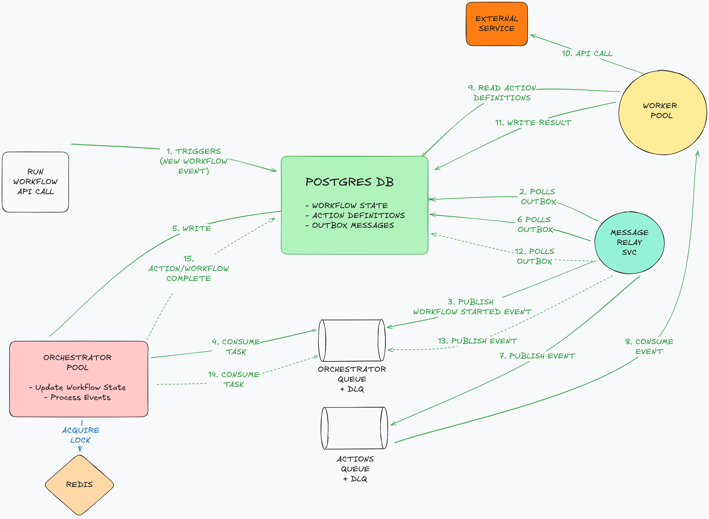

# ClickLess - Workflow Automation App

## Concepts

*   **Workflow Definition**: A template for a business process, defined as a DAG of steps. Stored in the database.

    ```
    {
        "description": "A simple invoice approval flow.",
        "start_at": "fetch_invoice",
        "steps": {
            "fetch_invoice": { "next": "validate_invoice" },
            "validate_invoice": { "next": "generate_report" },
            "generate_report": {
                "type": "delay",
                "duration_seconds": 15,
                "next": "archive_report" 
            },
            "archive_report": { 
            "next": "end",
            "retry": {
                "max_attempts": 3,
                "delay_seconds": 5
                }
            }
        }
    }
    ```

*   **Workflow Instance**: A running instance of a workflow definition. It maintains its own state (`data` blob), history, and current step.
*   **Action**: A single unit of work (e.g., call an API, query a database).
*   **Primitive Handler**: A reusable piece of code that knows *how* to perform a type of task (e.g., make an HTTP request, upload to S3).
*   **Event-Driven**: The system progresses through state transitions by passing messages asynchronously between services.

## Architecture




## Technology Stack

*   **Language**: Python 3.10+
*   **Framework**: Celery (for task queuing and workers)
*   **Database**: PostgreSQL
*   **Message Broker**: RabbitMQ
*   **Caching/Celery Backend**: Redis
*   **Containerization**: Docker & Docker Compose

## Developer Setup

#### Prerequisites
*   Docker and Docker Compose
*   Python 3.10+
*   `poetry`

#### 1. Clone the Repository
```bash
git clone <your-repo-url>
cd clickless
```

#### 2. Configure Environment Variables
Copy the example environment file and customize.
```bash
cp .env.example .env
```

#### 3. Build and Start Services
Build the Docker images and start all the required services (Postgres, RabbitMQ, Redis, and the application services).
```bash
docker-compose up --build -d
```

## Running the Application

Once the setup is complete, the application services will be running inside Docker containers.

*   **Orchestrator Service**: Listens to `orchestration_queue`.
*   **Worker Service**: Listens to `actions_queue`.
*   **Message Relay**: Periodically scans the `outbox` table.
*   **API Service**: To interact with the application.

#### Interacting with the API (Example)
You can start a new workflow by sending a request to the API endpoint.

```bash
curl -X POST http://localhost:8000/workflows/{workflow_unique_name}/run \
     -H "Content-Type: application/json" \
     -d '{
       "data": { "invoice_id": "inv_12345" }
     }'
```

#### Viewing Logs
To see the logs from all services in real-time:
```bash
docker-compose logs -f
```
To view logs for a specific service:
```bash
docker-compose logs -f worker
```

## Defining Workflows & Actions

1.  **Define an Action (Database)**: To create a new action (e.g., "fetch-github-issues"), add a new row to the `action_definitions` table. This involves providing the `handler_type` (e.g., `http_request`) and the specific `config` JSON for that action.
2.  **Define a Workflow (Database)**: Define the sequence of steps and their connections in the `workflow_definitions` table, referencing the action `name`s.

## Testing

The project is configured with `pytest`.

To run all tests:
```bash
pytest
```

## TODO

1. Add Monitoring & Observability
2. UI: Workflow Designer
3. Webhook Handler
4. Scheduler service to listen for workflows to process
5. Orchestration heartbeat for stuck worker processes